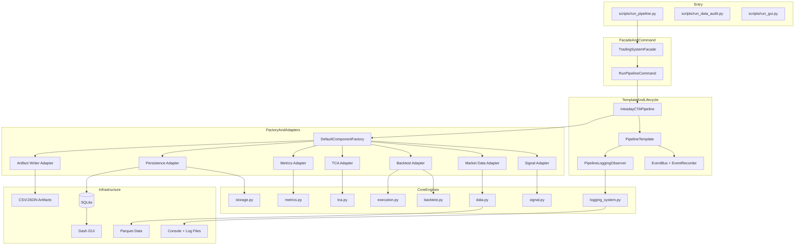

# SA Intraday CTA Architecture

## 1. Architecture Goals

The system is refactored to a pattern-driven architecture with the following goals:

- Composition-first assembly and low coupling between strategy, execution, persistence, and presentation.
- Duck typing through protocol ports for easier testing and extension.
- End-to-end intraday workflow: signal -> backtest -> execution -> TCA -> persistence -> monitoring.
- End-to-end intraday workflow: signal -> backtest -> execution -> TCA -> persistence -> monitoring.
- Real-time observability with stage-level and backtest-event logs.
- Backward compatibility: scripts still call run_pipeline through a facade-compatible entrypoint.

## 2. Layered Architecture

## 3. Runtime Sequence

1. scripts/run_pipeline.py calls run_pipeline.
2. run_pipeline builds TradingSystemFacade via TradingSystemBuilder.
3. Facade creates RunPipelineCommand and executes it.
4. PipelineTemplate controls lifecycle skeleton and stage events.
5. Logger is configured per run_id; stage observer and backtest hook stream logs in real time.
6. IntradayCTAPipeline loads config and selects common trading days.
7. Factory creates all concrete adapters for this run.
8. Signal adapter generates DualThrust target positions.
9. Backtest adapter runs event-style backtest with tick execution simulator.
10. Metrics/TCA/Execution summary are computed.
11. Artifact writer exports run outputs to CSV/JSON.
12. Persistence adapter writes run-scoped tables to SQLite.
13. GUI reads latest run_id and renders monitoring charts.

## 4. Module Map

- src/sa_cta/pipeline.py
  - Backward-compatible facade entrypoint.
- src/sa_cta/architecture/contracts.py
  - Ports (duck-typed protocols) and run dataclasses.
- src/sa_cta/architecture/events.py
  - Observer implementation for lifecycle event publication.
- src/sa_cta/architecture/adapters.py
  - Adapter layer over concrete engines and IO.
- src/sa_cta/architecture/factory.py
  - Abstract factory and strategy-aware component creation.
- src/sa_cta/architecture/template.py
  - Template method orchestration skeleton and concrete intraday pipeline.
- src/sa_cta/architecture/commands.py
  - Command object for pipeline execution.
- src/sa_cta/architecture/facade.py
  - Simplified high-level API.
- src/sa_cta/architecture/builder.py
  - Builder for system assembly and observer wiring.
- src/sa_cta/logging_system.py
  - Logger setup, stage observer, and backtest event hook.

## 5. Data Contracts

### 5.1 Input

- data/CZCE/sa/min1/YYYYMMDD/*.parquet
- data/CZCE/sa/ticks/YYYYMMDD/*.parquet

### 5.2 Signal Frame

- trade_day
- ts
- close
- day_open
- dual_thrust_range
- dual_thrust_upper
- dual_thrust_lower
- target_pos

### 5.3 Persistent Tables

- strategy_signals
- orders
- equity_curve
- fills
- trades
- tca_summary
- tca_by_hour
- tca_pre_trade
- tca_intra_day
- tca_post_trade
- tca_kpis
- strategy_summary
- execution_summary

All run-scoped writes include run_id.

## 6. Risk and Execution Controls

- max_position
- max_daily_loss
- force_flat_time
- max_consecutive_losses + cooldown_minutes
- holding_less_than_1day guard

Execution decomposition:

- spread_cost
- slippage_cost
- impact_cost
- fee
- total_cost
- implementation_shortfall

## 7. Outputs

Per run_id:

- dual_thrust_signals_<run_id>.csv
- orders_<run_id>.csv
- equity_curve_<run_id>.csv
- fills_<run_id>.csv
- trades_<run_id>.csv
- tca_summary_<run_id>.csv
- tca_by_hour_<run_id>.csv
- tca_pre_trade_<run_id>.csv
- tca_intra_day_<run_id>.csv
- tca_post_trade_<run_id>.csv
- tca_kpis_<run_id>.csv
- metrics_<run_id>.json
- strategy_summary_<run_id>.json
- execution_summary_<run_id>.json

## 8. Extension Guidance

- Add new strategy by extending factory signal creation and implementing a new signal adapter.
- Add new execution models as additional backtest/execution adapter families.
- Keep domain engines pure and adapt external interfaces in adapters only.
- Keep run_id in all new persistent tables for observability and rollback analysis.
